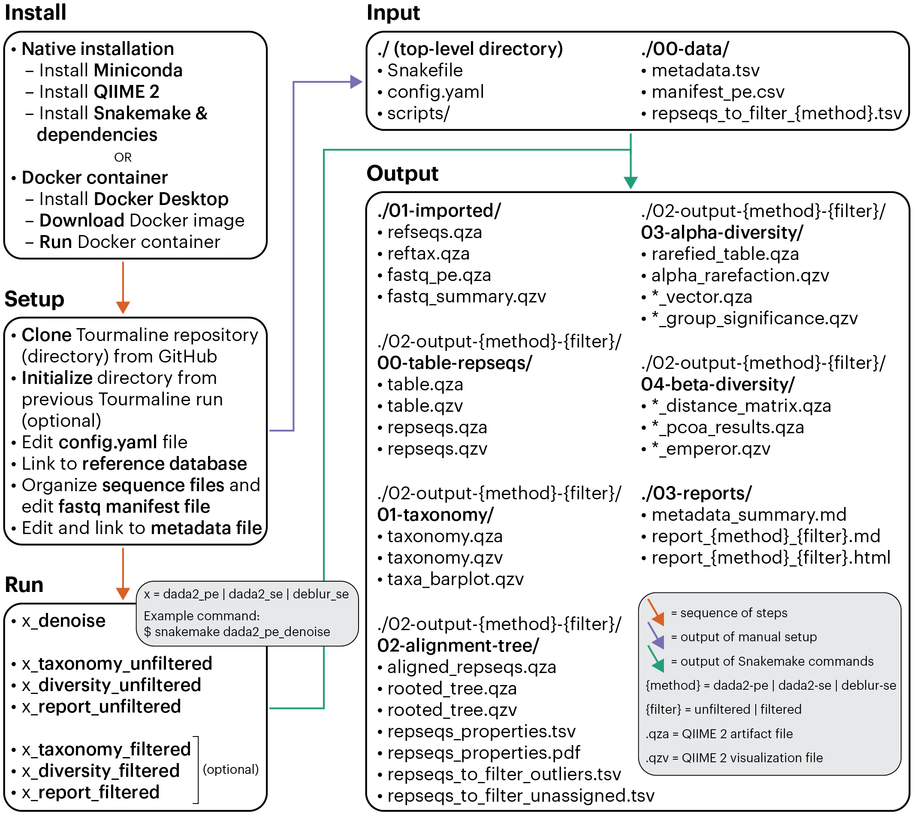

## Tourmaline

Tourmaline is an amplicon sequence processing workflow for Illumina sequence data that uses [QIIME 2](https://qiime2.org) and the software packages it wraps. Tourmaline manages commands, inputs, and outputs using the [Snakemake](https://snakemake.readthedocs.io/en/stable/) workflow management system.

### Why should I use Tourmaline?

Tourmaline has several features that enhance usability and interoperability:

* **Portability.** Native support for Linux and macOS in addition to Docker containers.
* **QIIME 2.** The core commands of Tourmaline, including the [DADA2](https://benjjneb.github.io/dada2/index.html) and [Deblur](https://github.com/biocore/deblur) packages, are all commands of QIIME 2, one of the most popular amplicon sequence analysis software tools available. You can print all of the QIIME 2 and other shell commands of your workflow before or while running the workflow.
* **Snakemake.** Managing the workflow with Snakemake provides several benefits: 
  - **Configuration file** contains all parameters in one file, so you can see what your workflow is doing and make changes for a subsequent run.
  - **Directory structure** is the same for every Tourmaline run, so you always know where your outputs are.
  - **On-demand commands** mean that only the commands required for output files not yet generated are run, saving time and computation when re-running part of a workflow.
* **Parameter optimization.** The configuration file and standard directory structure make it simple to test and compare different parameter sets to optimize your workflow. Included code helps choose read truncation parameters and identify outliers in representative sequences (ASVs).
* **Visualizations and reports.** Every Tourmaline run produces an HTML report containing a summary of your metadata and outputs, with links to web-viewable QIIME 2 visualization files.
* **Downstream analysis.** Analyze the output of single or multiple Tourmaline runs programmatically, with qiime2R in R or the QIIME 2 Artifact API in Python, using the provided R and Python notebooks or your own code.

### What QIIME 2 options does Tourmaline support?

If you have used QIIME 2 before, you might be wondering which QIIME 2 commands Tourmaline uses and supports. All commands are specified as rules in `Snakefile`, and typical workflows without and with sequence filtering are shown as directed acyclic graphs in the folder `dags`.  The main analysis features and options supported by Tourmaline and specified by the Snakefile are as follows:

* FASTQ sequence import using a manifest file, or use your pre-imported FASTQ .qza file
* Denoising with [DADA2](https://doi.org/10.1038/nmeth.3869) (paired-end and single-end) and [Deblur](https://doi.org/10.1128/msystems.00191-16) (single-end)
* Feature classification (taxonomic assignment) with options of [naive Bayes](https://doi.org/10.1186/s40168-018-0470-z), consensus [BLAST](https://doi.org/10.1186/1471-2105-10-421), and consensus [VSEARCH](https://doi.org/10.7717/peerj.2584)
* Feature filtering by taxonomy, sequence length, feature ID, and abundance/prevalence
* De novo multiple sequence alignment with [MUSCLE](https://doi.org/10.1093/nar/gkh340), [Clustal Omega](https://doi.org/10.1007/978-1-62703-646-7_6), or [MAFFT](https://doi.org/10.1093/molbev/mst010) (with masking) and tree building with [FastTree](https://doi.org/10.1093/molbev/msp077)
* Outlier detection with [odseq](https://doi.org/10.1186/s12859-015-0702-1)
* Interactive taxonomy barplot
* Tree visualization using [Empress](https://doi.org/10.1128/mSystems.01216-20)
* Alpha diversity, alpha rarefaction, and alpha group significance with four metrics: Faith's phylogenetic diversity, observed features, Shannon diversity, and Pielou’s evenness
* Beta diversity distances, principal coordinates, [Emperor](https://doi.org/10.1186/2047-217x-2-16) plots, and beta group significance (one metadata column) with four metrics: unweighted and weighted [UniFrac](https://doi.org/10.1038/ismej.2010.133), Jaccard distance, and Bray–Curtis distance
* Robust Aitchison PCA and biplot ordination using [DEICODE](https://doi.org/10.1128/mSystems.00016-19)

### Where can I learn more about Tourmaline?

The Tourmaline paper is published in *GigaScience*:

* Thompson, L. R., Anderson, S. R., Den Uyl, P. A., Patin, N. V., Lim, S. J., Sanderson, G. & Goodwin, K. D. Tourmaline: A containerized workflow for rapid and iterable amplicon sequence analysis using QIIME 2 and Snakemake. *GigaScience*, Volume 11, 2022, giac066, https://doi.org/10.1093/gigascience/giac066

### How do I get started? 

If this is your first time using Tourmaline or Snakemake, you may want to browse through the [Wiki](https://github.com/aomlomics/tourmaline/wiki) for a detailed walkthrough. If you want to get started right away, check out the Quick Start below and follow along with the video tutorial on [YouTube](https://youtu.be/xKfOxrXBXYQ).

## Quick Start

Tourmaline provides Snakemake rules for DADA2 (single-end and paired-end) and Deblur (single-end). For each type of processing, there are four steps:

1. the *denoise* rule imports FASTQ data and runs denoising, generating a feature table and representative sequences;
2. the *taxonomy* rule assigns taxonomy to representative sequences;
3. the *diversity* rule does representative sequence curation, core diversity analyses, and alpha and beta group significance; and
4. the *report* rule generates an HTML report of the outputs plus metadata, inputs, and parameters. Also, the *report* rule can be run immediately to run the entire workflow.

Steps 2–4 have *unfiltered* and *filtered* modes, the difference being that in the *taxonomy* step of *filtered* mode, undesired taxonomic groups or individual sequences from the representative sequences and feature table are removed. The *diversity* and *report* rules are the same for *unfiltered* and *filtered* modes, except the output goes into separate subdirectories.

### Install

Before you download the Tourmaline commands and directory structure from GitHub, you first need to install QIIME 2, Snakemake, and the other dependencies of Tourmaline. Two options are provided: a native installation on a Mac or Linux system and a Docker image/container. If you have a Mac with an Apple M1 chip, we recommend using Docker to install, following the M1 chip instructions. See the [Install](https://github.com/aomlomics/tourmaline/wiki/2-Install) page for more details.

#### Option 1: Native installation

To run Tourmaline natively on a Mac or Linux system, start with a Conda installation of QIIME 2 (for Linux, change "osx" to "linux"):

```bash
wget https://data.qiime2.org/distro/core/qiime2-2021.2-py36-osx-conda.yml
conda env create -n qiime2-2021.2 --file qiime2-2021.2-py36-osx-conda.yml
```

Activate the environment and install the other Conda- or PIP-installable dependencies:

```
conda activate qiime2-2021.2
conda install -c bioconda snakemake biopython muscle clustalo tabulate pandoc tabview
conda install -c conda-forge deicode
pip install git+https://github.com/biocore/empress.git
qiime dev refresh-cache
```

Finally, open R by entering `R` and install the R dependencies (if prompted, enter "n" to update none of the packages):

```R
if (!requireNamespace("BiocManager", quietly = TRUE))
    install.packages("BiocManager")
BiocManager::install("msa")
BiocManager::install("odseq")
```

#### Option 2: Docker container

To run Tourmaline inside a Docker container:

1. Install Docker Desktop (Mac, Windows, or Linux) from [Docker.com](https://docs.docker.com/get-docker/).
2. Open Docker app.
3. Increase the memory to 8 GB or more (Preferences -> Resources -> Advanced -> Memory).
4. Download the Docker image from [DockerHub](https://hub.docker.com/repository/docker/aomlomics/tourmaline) (command below).
5. Run the Docker image (command below).

```bash
docker pull aomlomics/tourmaline
docker run -v $HOME:/data -it aomlomics/tourmaline
```

If installing on a Mac with an Apple M1 chip, run the Docker image with the `--platform linux/amd64` command. It will take a few minutes for the image to load the first time it is run.

```bash
docker run --platform linux/amd64 -v $HOME:/data -it aomlomics/tourmaline
```

The `-v` (volume) flag above allows you to mount a local file system volume (in this case your home directory) to read/write from your container. Note that symbolic links in a mounted volume will not work.

Use mounted volumes to:

* copy metadata and manifest files to your container;
* create symbolic links from your container to your FASTQ files and reference database;
* copy your whole Tourmaline directory out of the container when the run is completed (alternatively, you can clone the Tourmaline directory inside the mounted volume).

See the [Install](https://github.com/aomlomics/tourmaline/wiki/2-Install#docker-container) page for more details on installing and running Docker.

### Setup

If this is your first time running Tourmaline, you'll need to set up your directory. Simplified instructions are below, but see the Wiki's [Setup](https://github.com/aomlomics/tourmaline/wiki/3-Setup) page for complete instructions. 

Start by cloning the Tourmaline directory and files:

```bash
git clone https://github.com/aomlomics/tourmaline.git
```

If using the Docker container, it's recommended you run the above command from inside `/data`.

#### Setup for the test data

The test data (16 samples of paired-end 16S rRNA data with 1000 sequences per sample) comes with your cloned copy of Tourmaline. It's fast to run and will verify that you can run the workflow.

Download reference database sequence and taxonomy files, named `refseqs.qza` and `reftax.qza` (QIIME 2 archives), in `01-imported`:

```bash
cd tourmaline/01-imported
wget https://data.qiime2.org/2021.2/common/silva-138-99-seqs-515-806.qza
wget https://data.qiime2.org/2021.2/common/silva-138-99-tax-515-806.qza
ln -s silva-138-99-seqs-515-806.qza refseqs.qza
ln -s silva-138-99-tax-515-806.qza reftax.qza
```

Edit FASTQ manifests `manifest_se.csv` and `manifest_pe.csv` in `00-data` so file paths match the location of your `tourmaline` directory. In the command below, replace `/path/to` with the location of your `tourmaline` directory—or skip this step if you are using the Docker container and you cloned `tourmaline` into `/data`:

```bash
cd ../00-data
cat manifest_pe.csv | sed 's|/data/tourmaline|/path/to/tourmaline|' > temp && mv temp manifest_pe.csv 
cat manifest_pe.csv | grep -v "reverse" > manifest_se.csv
```

Go to **Run Snakemake**.

#### Setup for your data

Before setting up to run your own data, please note:

* Symbolic links can be used for any of the input files, which may be useful for large files (e.g., the FASTQ and reference database .qza files).
* If you plan on using Deblur, sample names must not contain underscores (only alphanumerics, dashes, and/or periods).

Now edit, replace, or store the required input files as described here:

1. Edit or replace the metadata file `00-data/metadata.tsv`. The first column header should be "sample_name", with sample names matching the FASTQ manifest(s), and additional columns containing any relevant metadata for your samples. You can use a spreadsheet editor like Microsoft Excel or LibreOffice, but make sure to export the output in tab-delimited text format.
2. Prepare FASTQ data:
    * Option 1: Edit or replace the FASTQ manifests `00-data/manifest_pe.csv` (paired-end) and/or `00-data/manifest_se.csv` (single-end). Ensure that (1) file paths in the column "absolute-filepath" point to your .fastq.gz files (they can be anywhere on your computer) and (2) sample names match the metadata file. You can use a text editor such as Sublime Text, nano, vim, etc.
    * Option 2: Store your pre-imported FASTQ .qza files as `01-imported/fastq_pe.qza` (paired-end) and/or `01-imported/fastq_se.qza` (single-end).
3. Prepare reference database:
    * Option 1: Store the reference FASTA and taxonomy files as `00-data/refseqs.fna` and `00-data/reftax.tsv`.
    * Option 2: Store the pre-imported reference FASTA and taxonomy .qza files as `01-imported/refseqs.qza` and `01-imported/reftax.qza`.
4. Edit the configuration file `config.yaml` to set DADA2 and/or Deblur parameters (sequence truncation/trimming, sample pooling, chimera removal, etc.), rarefaction depth, taxonomic classification method, and other parameters. This YAML (yet another markup language) file is a regular text file that can be edited in Sublime Text, nano, vim, etc.
5. Go to **Run Snakemake**.

### Run Snakemake

Shown here is the DADA2 paired-end workflow. See the Wiki's [Run](https://github.com/aomlomics/tourmaline/wiki/4-Run) page for complete instructions on all steps, denoising methods, and filtering modes.

Note that any of the commands below can be run with various options, including `--printshellcmds` to see the shell commands being executed and `--dryrun` to display which rules would be run but not execute them. To generate a graph of the rules that will be run from any Snakemake command, see the section "Directed acyclic graph (DAG)" on the [Run](https://github.com/aomlomics/tourmaline/wiki/4-Run) page.

From the `tourmaline` directory (which you may rename), run Snakemake with the *denoise* rule as the target:

```bash
snakemake dada2_pe_denoise
```

Pausing after the *denoise* step allows you to make changes before proceeding:

* Check the table summaries and representative sequence lengths to determine if DADA2 or Deblur parameters need to be modified. If so, you can rename or delete the output directories and then rerun the *denoise* rule.
* View the table visualization to decide an appropriate subsampling (rarefaction) depth. Then modify the parameters "alpha_max_depth" and "core_sampling_depth" in `config.yaml`.
* Decide whether to filter your feature table and representative sequences by taxonomy or feature ID. After the *taxonomy* step, you can examine the taxonomy summary and bar plot to aid your decision. If you do filter your data, all output from that point on will go in a separate folder so you can compare output with and without filtering.

#### Unfiltered mode

Continue the workflow without filtering (for now). If you are satisfied with your parameters and files, run the *taxonomy* rule (for unfiltered data):

```bash
snakemake dada2_pe_taxonomy_unfiltered
```

Next, run the *diversity* rule (for unfiltered data):

```bash
snakemake dada2_pe_diversity_unfiltered
```

Finally, run the *report* rule (for unfiltered data):

```bash
snakemake dada2_pe_report_unfiltered
```

#### Filtered mode

After viewing the *unfiltered* results—the taxonomy summary and taxa barplot, the representative sequence summary plot and table, or the list of unassigned and potential outlier representative sequences—the user may wish to filter (remove) certain taxonomic groups or representative sequences. If so, the user should first check the following parameters and/or files:

* copy `2-output-dada2-pe-unfiltered/02-alignment-tree/repseqs_to_filter_outliers.tsv` to `00-data/repseqs_to_filter_dada2-pe.tsv` to filter outliers, or manually include feature IDs in `00-data/repseqs_to_filter_dada2-pe.tsv` to filter those feature IDs (change "dada2-pe" to "dada2-se" or "deblur-se" as appropriate);
*  `exclude_terms` in `config.yaml` – add taxa to exclude from representative sequences, if desired;
*  `repseq_min_length` and `repseq_max_length` in `config.yaml` – set minimum and/or maximum lengths for filtering representative sequences, if desired;
*  `repseq_min_abundance` and `repseq_min_prevalence` in `config.yaml` – set minimum abundance and/or prevalence values for filtering representative sequences, if desired.

Now we are ready to filter the representative sequences and feature table, generate new summaries, and generate a new taxonomy bar plot, by running the *taxonomy* rule (for filtered data):

```bash
snakemake dada2_pe_taxonomy_filtered
```

Next, run the *diversity* rule (for filtered data):

```bash
snakemake dada2_pe_diversity_filtered
```

Finally, run the *report* rule (for filtered data):

```bash
snakemake dada2_pe_report_filtered
```

### View output

#### View report and output files

Open your HTML report (e.g., `03-reports/report_dada2-pe_unfiltered.html`) in [Chrome](https://www.google.com/chrome/){target="_blank"} or [Firefox](https://www.mozilla.org/en-US/firefox/new/){target="_blank"}. To view the linked files: 

* QZV (QIIME 2 visualization): click to download, then drag and drop in [https://view.qiime2.org](https://view.qiime2.org){target="_blank"}. Empress trees (e.g., `rooted_tree.qzv`) may take more than 10 minutes to load.
* TSV (tab-separated values): click to download, then open in Microsoft Excel or Tabview (command line tool that comes with Tourmaline).
* PDF (portable document format): click to open and view in new tab.

Downloaded files can be deleted after viewing because they are already stored in your Tourmaline directory.

### More tips

#### Troubleshooting

* The whole workflow with test data should take ~3–5 minutes to complete. A normal dataset may take several hours to complete.
* If any of the above commands don't work, read the error messages carefully, try to figure out what went wrong, and attempt to fix the offending file. A common issue is the file paths in your FASTQ manifest file need to be updated.
* If you are running in a Docker container and you get an error like "Signals.SIGKILL: 9", you probably need to give Docker more memory. See the Wiki section on [Installation options](https://github.com/aomlomics/tourmaline/wiki/2-Install#installation-options).

#### Power tips

* The whole workflow can be run with just the command `snakemake dada2_pe_report_unfiltered`  (without filtering representative sequences) or  `snakemake dada2_pe_report_filtered`  (after filtering representative sequences). Warning: If your parameters are not optimized, the results will be suboptimal (garbage in, garbage out).
* If you want to make a fresh run and not save the previous output, simply delete the output directories (e.g., `02-output-{method}-{filter}` and `03-report`) generated in the previous run.
* You can always delete any file you want to regenerate. Then there are several ways to regenerate it: run `snakemake FILE` and Snakemake will determine which rules (commands) need to be run to generate that file; or, run `snakemake RULE` where the rule generates the desired file as output.
* If you've run Tourmaline on your dataset before, you can speed up the setup process and initialize a new Tourmaline directory (e.g., `tourmaline-new`) with the some of the files and symlinks of the existing one (e.g., `tourmaline-existing`) using the command below:

  ```bash
  cd /path/to/tourmaline-new
  scripts/initialize_dir_from_existing_tourmaline_dir.sh /path/to/tourmaline-existing
  ```

  You may get error messages if some files don't exist, but it should have copied the files that were there. The files that will be copied from the existing directory to the new directory are:

  ```
  config.yaml
  00-data/manifest_pe.csv
  00-data/manifest_se.csv
  00-data/metadata.tsv
  00-data/repseqs_to_filter_dada2-pe.tsv
  00-data/repseqs_to_filter_dada2-se.tsv
  00-data/repseqs_to_filter_deblur-se.tsv
  01-imported/refseqs.qza
  01-imported/reftax.qza
  01-imported/classifier.qza
  ```

  Ensure you make any changes to your configuration file and (if necessary) delete any files you want to be regenerated before you run Snakemake.

#### Alternatives

Some alternative pipelines for amplicon sequence analysis include the following:

* Anacapa Toolkit from UCLA: https://github.com/limey-bean/Anacapa
* Banzai from MBON: https://github.com/jimmyodonnell/banzai
* Tagseq QIIME 2 Snakemake workflow: https://github.com/shu251/tagseq-qiime2-snakemake
