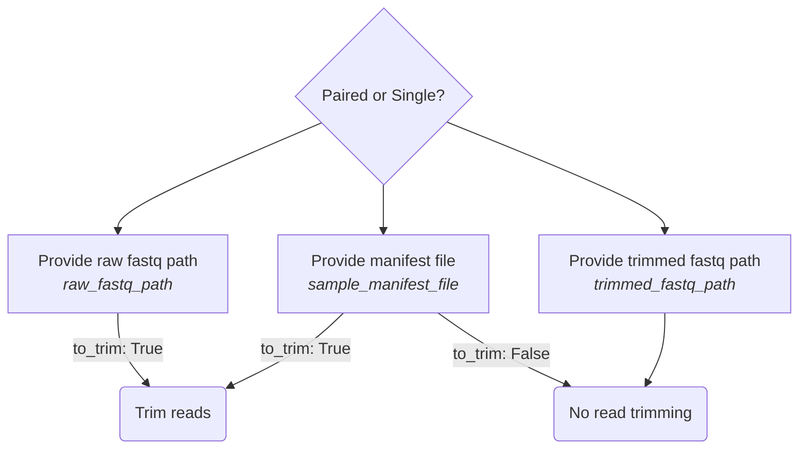

# Tourmaline 2.0 Instructions

## setup

make a config file for every step


## running

### Sample step



 ```
 snakemake --use-conda -s sample_test.Snakefile --configfile samp_config_test.yaml --cores 4
 ```

 ```
     printf " -s|--step, sample, repseqs\n"
    printf " -c|--configfile, config-01-sample.yaml\n"
    printf " -n|--cores, numeric\n"
    printf " -h|--help, Print help\n"
 ```

 ### Repseqs step

 ```mermaid
 flowchart TD
    subgraph ide1 [Run name]
    A["`Choose different Step 1 folder for Step 2
    _run_name_: Run2
    _sample_run_name_: Run1`"] 
    B["`Provide external fastq.qza file
    _run_name_: Run1
    _fastq_qza_file_`"]
    C["`Use same run_name as Step 1
    _run_name_: Run1`"]
    end
    E(Paired reads)
    F(Single end reads)
    A ----> E & F
    B ----> E & F
    C ----> E & F
    E --> G{dada2pe}
    E --> H{dada2se} 
    E --> I{deblur}
    F --> H
    F --> I

```
